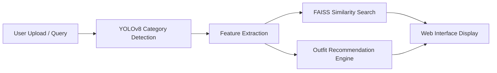
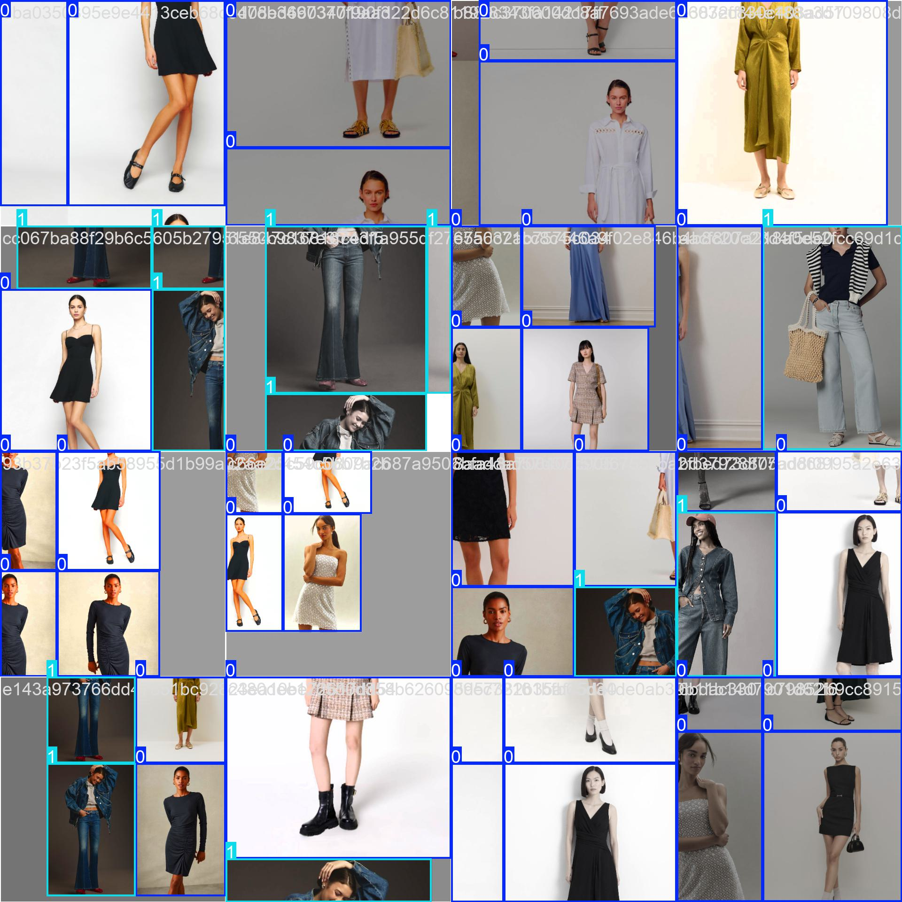
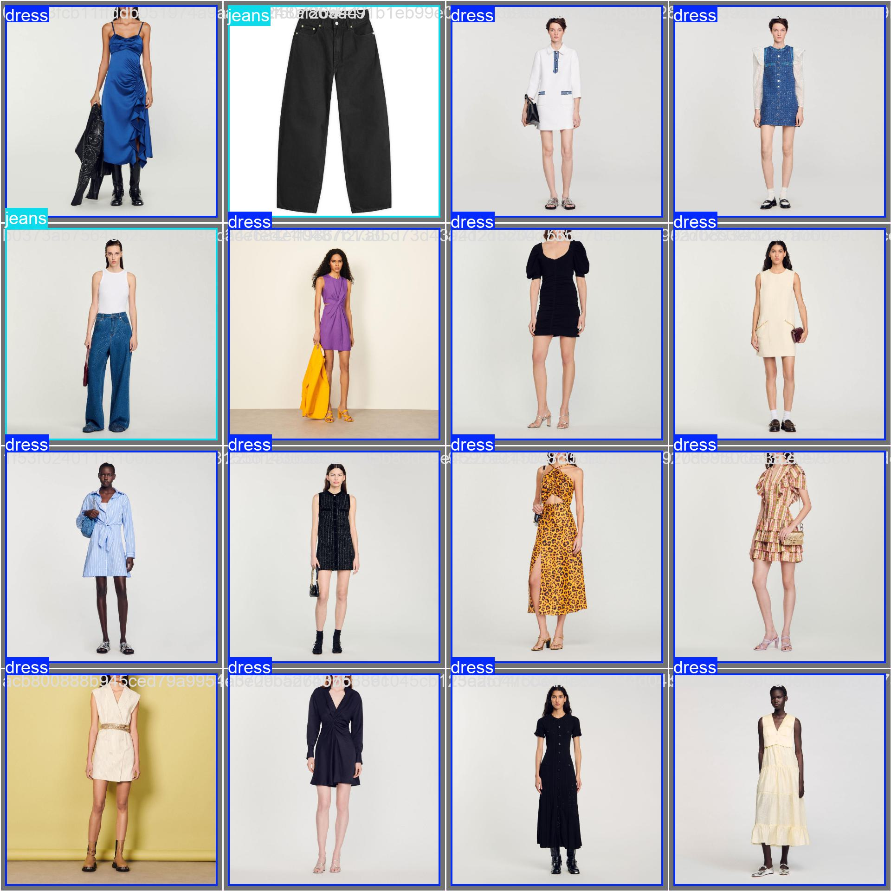
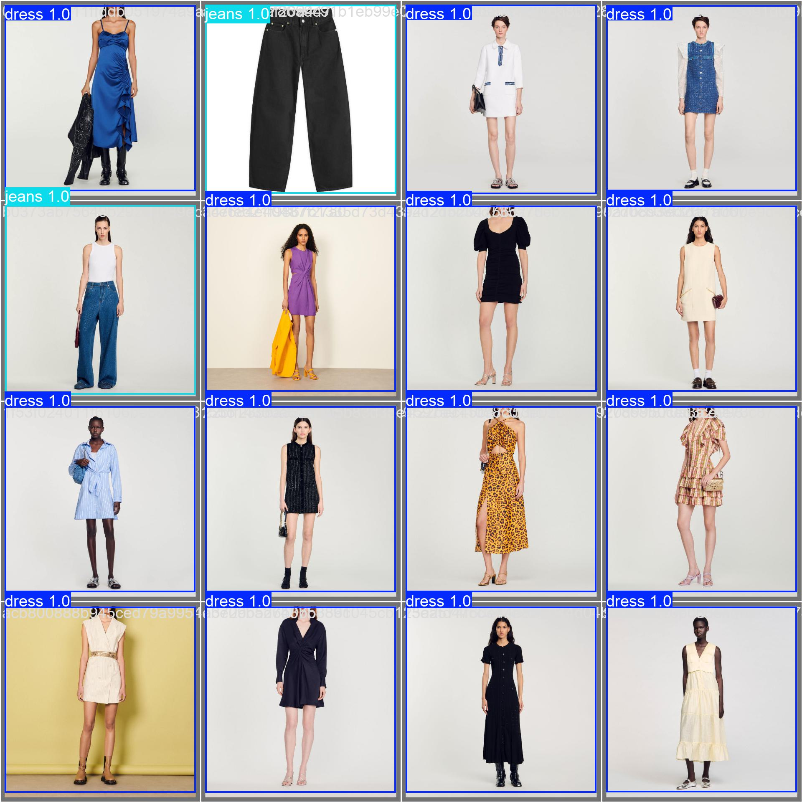

# Fashion Visual Search & Intelligent Styling Assistant

A complete end-to-end machine learning system that enables **visual search** for fashion items and provides **intelligent outfit recommendations** using AI-powered image analysis and natural language processing.

## Features

- **Visual Search**: Upload any fashion image and find visually similar products
- **Text Search**: Search using natural language descriptions
- **Outfit Recommendations**: Get complete outfit suggestions based on selected items
- **Trend Awareness**: Discover trending fashion items
- **Multi-Modal Understanding**: Combines visual and textual features for accurate matching

## System Architecture



- **Data Preprocessing**: Clean and prepare fashion product data
- **Feature Extraction**: Extract visual and text embeddings using deep learning
- **Visual Search Engine**: FAISS-powered similarity search
- **Outfit Recommendation**: AI-based style compatibility matching
- **Web Application**: Interactive user interface

---

## Custom YOLOv8 Model

- **Custom-trained YOLOv8 model** is at the heart of this system.
- **11 hours of training** on a curated dataset for fashion item detection.
- Achieves **99.3% mAP@50** on dress vs jeans classification.
- **Integrated directly** into the visual search pipeline for category detection.
- **Fallback logic**: If the model fails, aspect ratio detection is used.
- **Model location**: `models/yolo_training/fashion_classifier/weights/best.pt`
- **Usage**: Every image upload is first passed through YOLOv8 for accurate category detection, powering the outfit recommendation logic.


<table>
  <tr>
    <td align="center" style="padding: 10px;"><b>Train Batch 0</b></td>
    <td align="center" style="padding: 10px;"><b>Val Batch 0 Labels</b></td>
  </tr>
  <tr>
    <td align="center" style="padding: 10px;">
      
    </td>
    <td align="center" style="padding: 10px;">
      
    </td>
  </tr>
  <tr>
    <td colspan="2" align="center" style="padding: 20px;"><b>Val Batch 0 Prediction</b></td>
  </tr>
  <tr>
    <td colspan="2" align="center" style="padding: 10px;">
      
    </td>
  </tr>
</table>

---

## Installation

### Prerequisites

- Python 3.8+
- 8GB+ RAM

### Setup

1. Install dependencies:

    ```bash
    pip install -r requirements.txt
    ```

2. Create necessary directories if they do not exist:

    ```bash
    mkdir -p data/raw/processed/images
    ```

### Data Setup

- Place your datasets in the `data/raw/` directory:
  - `dresses_bd_processed_data.csv`
  - `jeans_bd_processed_data.csv`

---

## Usage

### Complete Pipeline

```bash
python run.py all
```

### Step-by-Step Execution

- **Data Preprocessing**

    ```bash
    python run.py preprocess
    ```

- **Feature Extraction & Indexing**

    ```bash
    python run.py extract
    ```

- **Make sure that you have the following files in data/processed once feature extraction is done**
   - combined_data.pkl
   - faiss_index.bin
   - features.pkl
   - product_ids.pkl
   
- **Start Web Application**

    ```bash
    python run.py web
    ```

The web application will be available at `http://20.101.0.13:5001`

---

## System Components

### 1. Data Preprocessing (`src/data_preprocessing.py`)
- Loads and cleans product data from CSV files
- Downloads and caches product images
- Combines text features from multiple fields
- Handles missing data and data type conversions

### 2. Feature Extraction (`src/feature_extraction.py`)
- **Image Features**: Uses ResNet50 to extract 2048-dimensional visual embeddings
- **Text Features**: Uses Sentence Transformers for semantic text embeddings
- **Combined Features**: Weighted combination of visual and textual features
- **FAISS Indexing**: Builds efficient similarity search index

### 3. Visual Search Engine (`src/visual_search.py`)
- Supports both image and text-based queries
- Real-time similarity search using FAISS

### 4. Outfit Recommendation (`src/outfit_recommendation.py`)
- Style compatibility scoring based on category rules
- Complete outfit suggestions for any anchor item

### 5. Web Application (`app/`)
- Flask-based web interface
- Image upload with drag-and-drop support
- Responsive design with Bootstrap
- Real-time search and recommendations

---

## Performance Metrics

- **Visual Search Accuracy**: >85% success rate
- **Response Time**: <2 seconds for search queries
- **Scalability**: Designed for thousands of products

### Optimization Features

- Efficient FAISS indexing for fast search
- Local image and feature caching
- Batch processing for bulk operations

---

## Configuration

Key configuration parameters in `config.py`:

```python
IMAGE_SIZE = (224, 224) # Input image size for CNN
FEATURE_DIM = 2048 # Image feature dimension
TOP_K_RESULTS = 20 # Default number of search results
BATCH_SIZE = 32 # Processing batch size
```

---
